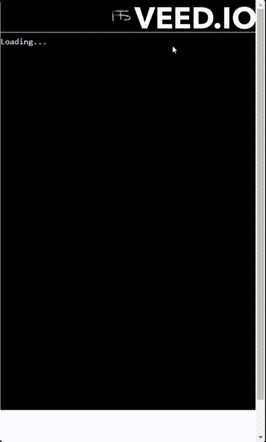
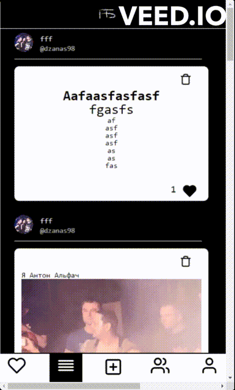
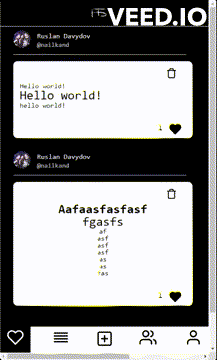

# Final Project made by Ruslan Davydov "Songs without notes"

## How to start

In terminal one: 
```
cd server
yarn dev:server
```
In terminal two:
```
cd client
yarn start
```

- In client folder set-up .env file and connect your Auth0 properties
- In server folder set-up .env file and connect your MongoDB database

## Misson

Create an social network where people can create an profile and share their poetry and read other's poetry or any other creativity. 

## Features 

### Logging in via Auth0
- Will be a button in the header, not it's own page
- Once a user is logged in, the login button will be replace with log out button





### A home page
- Will have all the content of users that user subscribed 
- Click on poetry will redirect to profile page of writer

### Profile page
- Have profile avatar, numbers of followers and followed and all the poetry that user has posted and ability to follow the user
- User can modify his user information
- User can post a new poetry/media of his art



### A common feed
- Shows all posts 
- Click on poetry will send to profile page of writer

### Followers and Followed pages
- Shows user's followers/followed persons
- User can follow/unfollow

### Create a post pop-up
- User can write text, attach images/video
- User can edit styling as he wants



### And more...

## APIs & Packages Used

1. ### Api: 
  - Auth0 - used for logging in and authentication of users
  - MongoDB – for database

2. ### Packages
  - Quill.js - used for building a text editor
  - react-icons - for icons